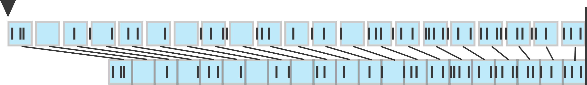

# SSD: Scaling Subspace Decomposition

Find eigenvalue S, and corresponding eigenvector X, using Reighley quotient R(A,B)= x'Ax/x'Bx = X' S X / X'X 

Example:

A = (x1 - x2)' * ( x1 - x2); % L2 normal, x's dimension is nxp, n = number of observations, p = dimensionality. 

B = cov([x1; x2]); 

[S,X] = ReighleyQuotient(A,B,'min',1)

# Note on SSD:
Scaling analysis has two steps, 1) finding the scaling dimension on the training set and 2) validating with the test data. This function handles the first step using an optimization. Its input has the matrix A and B. Where A is the distance of the population activity A = (r1 - r2)' * ( r1 - r2) and a covariance B = cov([r1; r2]). 
 r1 and r2  has dimension of n x p. n is the number of observations (different time bins), and p is the number of neurons (or it is the relevent subspace after denoising). It outputs a set of eigen vectors X, which are the predicted scaling directions in descending/ascending order.

In the Nature Neuro article, training data r1 and r2 are the population spiking in two conditions: long and short production interval. Since the two need to be same dimensionality, spike counts were obtained by a time warping operation as described in the Methods section. For example, the short condition has interval of 640ms, and 20 bins. Accordingly, we sampled 20 time bins from Set to Go  during the 1700ms interval, taking one trial of one neuron as an example below

  

In the article, dimensionality was reduced to the scaling subspace as spanned by the first 3 eigen vectors. Then, it was verified with data from other intervals and conditions.
